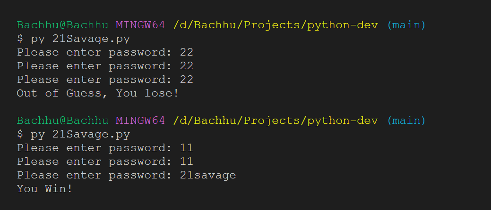

# Python Practice Problems 🚀

This repository contains a collection of Python practice problems and exercises. Each Python file in the repository represents a separate coding challenge.

### Previews

21 savage - while loop - 


## Getting Started

1. Clone the repository to your local machine:

   ```bash
   git clone https://github.com/your-username/python-practice-problems.git
